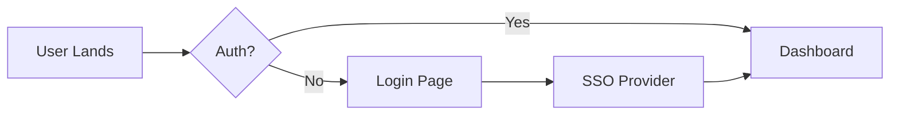

import TOCInline from '@theme/TOCInline';
import Admonition from '@theme/Admonition';

<Admonition type="note" title="Status">
  **Draft**: Awaiting Engineering & Design Review.
</Admonition>

## 1. Executive Summary & Strategy
**Elevator Pitch**
*In 2 sentences, what are we building and why is it game-changing?*

**Strategic Alignment (OKRs)**
* **Objective:** [e.g., Expand to Enterprise Market]
* **Key Result:** [e.g., Acquire 50 enterprise leads via new dashboard]

**Success Metrics (KPIs)**
| Metric Type | Metric Name | Current Baseline | Target (Success) | Guardrail Metric (What can't break?) |
|-------------|-------------|------------------|------------------|--------------------------------------|
| North Star  | Conversion Rate | 2.5% | 5.0% | Page Load Time (< 1.5s) |
| Secondary   | Daily Active Users| 10k | 12k | CS Ticket Volume |

## 2. Problem Definition & Insights
**User Problem**
*As a [Persona], I struggle with [Problem], which causes [Business Impact/Churn].*

**Evidence & Research**
* **Qualitative:** [Link to User Interviews/Dovetail/Notion]
* **Quantitative:** [Link to Amplitude/Mixpanel Dashboard showing drop-off]
* **Market Signal:** Competitor X already has this feature.

## 3. Solution Scope (The What)
**Core Value Proposition**
We will solve this by...

**Scope Boundaries**
| In Scope (MVP) | Out of Scope (Next Phase) |
|----------------|---------------------------|
| SSO Login (Google, Microsoft) | SAML Custom Integration |
| PDF Export | CSV/Excel Export |

**User Stories (BDD Style Recommended)**
| ID | Persona | User Story | Acceptance Criteria (Gherkin/Checklist) | Priority |
|----|---------|------------|-----------------------------------------|----------|
| US-1 | Admin | Login via Google | 1. Click "Login with Google" 2. Redirect to Dashboard 3. User created in DB if new | P0 |

## 4. User Experience (UX/UI)
**Flow Diagram**

**Design Artifacts**
* [Link to Figma Prototype]
* [Link to Miro User Journey]

## 5. Go-to-Market & Release Strategy
**Release Phasing**
* [ ] **Alpha:** Internal Team (Dogfooding)
* [ ] **Beta:** 5% of Users (via Feature Flag `enable_new_dashboard`)
* [ ] **GA:** 100% Rollout

**Marketing & Enablement**
* [ ] FAQ for CS Team written?
* [ ] Blog post draft created?
* [ ] Product Tour/Tooltip implementation needed?

## 6. Open Questions & Risks
* **Risk:** 3rd party API rate limits. **Mitigation:** Implement caching.
* **Question:** Do we need legal approval for data export? **Owner:** PM to ask Legal.
