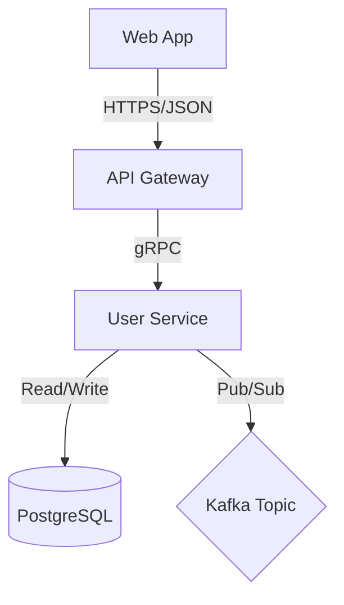

import TOCInline from '@theme/TOCInline';
import Admonition from '@theme/Admonition';

<Admonition type="caution" title="Status">
  **Review Needed**: Pending approval from Principal Engineer & Security.
</Admonition>

## 1. Introduction
**Summary**
Technical proposal to implement [Feature] using [Technology].

**Motivation**
Why this approach? Why now? Link to [PRD-001].

## 2. Detailed Design
### Architecture Diagram (C4 Level 2)


### API Interface (OpenAPI/GraphQL)
```yaml
# Snippet
paths:
  /v1/resource:
    post:
      summary: Creates resource
      tags: [Resource]
```

### Data Model
* **Database:** PostgreSQL 15
* **Migration Strategy:** Non-breaking change (Add column, backfill, enforce constraints).

## 3. Operational Readiness (The "Day 2" Concerns)
**Observability & Monitoring**
* **Metrics (Golden Signals):**
    * `http_request_duration_seconds_bucket` (Latency)
    * `http_requests_total` (Traffic)
    * `app_errors_total` (Errors)
* **Logs:** Structure (JSON) includes `trace_id`, `user_id`.
* **Alerts:** PagerDuty trigger if Error Rate > 1% for 5 mins.

**Security & Privacy (Threat Model)**
* **Auth:** Requires Bearer Token (Scope: `read:resource`).
* **PII Data:** Does this store email/phone? [Yes/No]. If Yes, encryption at rest required.
* **OWASP Top 10 Check:** Validated input sanitization?

**FinOps & Capacity Planning**
* **Estimated Cost:** ~$50/month (AWS RDS t3.medium + Fargate spot).
* **Scale Limits:** Designed for 1000 RPS. Breakpoint at 5000 RPS.

## 4. Execution Plan
**Implementation Phases**
1.  **Phase 1:** API Skeleton & DB Migration (Date: YYYY-MM-DD)
2.  **Phase 2:** Business Logic & Unit Tests
3.  **Phase 3:** Integration with Frontend & Load Testing

**Rollback Strategy**
If P99 Latency > 500ms, toggle Feature Flag `disable_new_arch` to revert to legacy path.

## 5. Alternatives Considered
* **Option A (Selected):** PostgreSQL. Reason: Relational data integrity needed.
* **Option B (Rejected):** DynamoDB. Reason: Complex access patterns required expensive scans.
