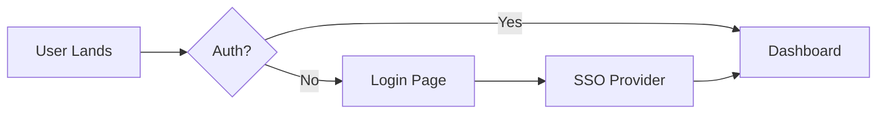

# Vision & Mission

> **Noderium exists to resolve the fundamental tensions in personal knowledge management—not through more features, but through a radical reimagination of architecture.**

---

## The Problem: Why 80% Abandon PKM Tools

When knowledge workers open a personal knowledge management app, they carry both hope and fear:

- **Hope**: "This system will help me never lose an important idea."
- **Fear**: "But I don't want to spend more time organizing than thinking."

This is the paradox at the heart of the PKM industry. Tools like Obsidian, Logseq, Roam, and Notion solve important parts of the problem—providing powerful structure, clear thinking flows, collaboration—but leave open the most fundamental question:

**Why do 80% of users abandon these systems within 6 months?**

The answer isn't "lack of features." It's that no tool has resolved the **irreconcilable tension** between capture, organization, and retrieval without imposing a cognitive cost that ultimately exceeds the benefit.

---

## The Three Fundamental Tensions

### Tension 1: The Capture Paradox

Knowledge workers face a primal fear: forgetting. This fear is evolutionarily deep—our minds evolved in environments where shared memory was a survival advantage.

- You read an article that changes your perspective. You think "I need to remember this." But manual capture is friction. So you *promise yourself* to remember. You don't.
- You have an idea during a conversation. No paper. Mental note. Disappears in the noise of hundreds of other daily thoughts.
- You discover a valuable resource. You think "I'll need this later." You leave it for later. "Later" never comes.

**The cost**: 8.2 hours per week wasted searching, recreating, or duplicating information.

### Tension 2: The Maintenance Tax

Here's where everything falls apart. Once you *start* capturing, a new reality emerges: **Capturing is easy. Maintaining is work.**

Studies show that active PKM users spend **3-5 hours per week just organizing**—not thinking, not creating, not learning. Just maintaining the system.

- You capture a note. But where does it go? Which folder? Which tag? (Cognitive decision)
- You capture 50 notes. Your taxonomies start to crumble. Tags lose meaning. Folders seem random. (Maintenance fatigue)
- You abandon the system for a month. Return to chaos. Need to "organize everything again." (Cognitive friction)

**The pattern**: User hopscotch. Try Obsidian for 2 months (abandon). Try Roam for 1 month (abandon). Try Notion for 3 months (abandon). Return to Apple Notes. 80% abandonment in 6 months.

### Tension 3: Retrieval Failure

Now suppose you *managed* to maintain the system for 3 months. You accumulated 200 well-organized notes. You need information you know is there somewhere.

You search. Fail. Search again. Fail.

Studies show that **enterprise search has only 10% accuracy in typical contexts**. Search is an interaction paradigm that assumes you know *what* you're looking for—which is rarely true in personal knowledge contexts.

When the system fails at retrieval, something fundamental is wounded: **trust**. You stop believing the system is useful. And then? Abandonment.

---

## Our Core Beliefs

Noderium is founded on 5 non-negotiable beliefs:

### 1. Your Knowledge is an Extension of Your Identity

It's not a commodity. It deserves respect, privacy, and control. The system should put *you* at the center, not the technology.

### 2. Cognitive Load is Real and Finite

Every decision you make about "how to organize" is cognitive load stolen from "what to think." Design must eliminate this friction, not add to it.

### 3. Trust is the Foundation

If you don't trust you'll find what you saved, you won't save. If you don't trust your data is secure, you won't think deeply. Trust comes from transparency, local control, and results.

### 4. AI Changes the Game

It's not a "feature." It's a fundamental reimagination of how capture, organization, and retrieval can work when you have an intelligent agent as a partner. But only if AI is local-first, yours, and transparent.

### 5. Simplicity in Complexity is Luxury

Most PKM tools offer infinite customization as a virtue. But infinite options = paralysis. True luxury is a system that *works beautifully* for 90% of users without any configuration. Focused constraints on the essential are more liberating than infinite options.

---

## The Answer: A Different Architecture

Noderium answers a simple but profound question:

> **"What if capturing knowledge was as simple as having an idea? And retrieval was as natural as talking to a smart person? And we never had to think about organization?"**

This isn't a question of features. It's a question of **moral architecture**.

| Dimension | Obsidian | Logseq | Roam | Notion | **Noderium** |
|-----------|----------|--------|------|--------|--------------|
| Local-First | ✅ | ✅ | ❌ | ❌ | ✅ (core) |
| AI-Native | 🟡 (plugins) | 🟡 (plugins) | ❌ | 🟡 | ✅ (architecture) |
| Unified Capture | 🟡 (extensions) | 🟡 | 🟡 | ✅ | ✅ (ubiquitous) |
| Zero-Maintenance Organization | ❌ | ❌ | ❌ | 🟡 | ✅ (automatic) |
| Conversational Retrieval | ❌ | ❌ | ❌ | 🟡 | ✅ (primary) |
| Onboarding (&lt;10 min) | ❌ | 🟡 | 🟡 | 🟡 | ✅ |
| Data Portability | ✅ | ✅ | ❌ | ❌ | ✅ (transparent) |

---

## Why Now?

Three convergences create a unique window of opportunity:

### 1. The Era of Conversational AI Has Arrived

Before: AI was a gimmick. Now: professionals use LLMs routinely. Expectations have changed. But no PKM tool has *rethought UX* assuming AI as an architectural primitive.

### 2. The Local-First Movement is Mainstream

Obsidian and Logseq are growing faster than Notion. Privacy concerns aren't fringe—they're mainstream. The moment is now.

### 3. The Current Failure is Evident

80% abandonment isn't a design accident. It's an architecture failure. Every existing tool solves *part* of the problem while creating new problems elsewhere.

---

## Product Vision

| Phase | Focus |
|-------|-------|
| **Phase 1: Foundation** | Core capture & organization, local conversational retrieval, basic collaboration, mobile MVP |
| **Phase 2: Integration** | Rich content (articles, videos, audio), multi-modal synthesis, native integrations (Slack, Email) |
| **Phase 3: Intelligence** | Advanced reasoning, AI proactivity, team knowledge graphs |
| **Phase 4: Ubiquity** | Workflow integration, semi-autonomous agency, emergent thinking patterns |

---

## The Fundamental Bet

Noderium bets that the biggest market isn't in **more features**, but in **resolving the fundamental tension**.

If we can eliminate the 3 tensions (capture, maintenance, retrieval) simultaneously while maintaining trust (local-first), the rest follows.

Users don't abandon because they lack features. They abandon because the system costs more than it's worth.

**Noderium solves this through architecture, not features.**
