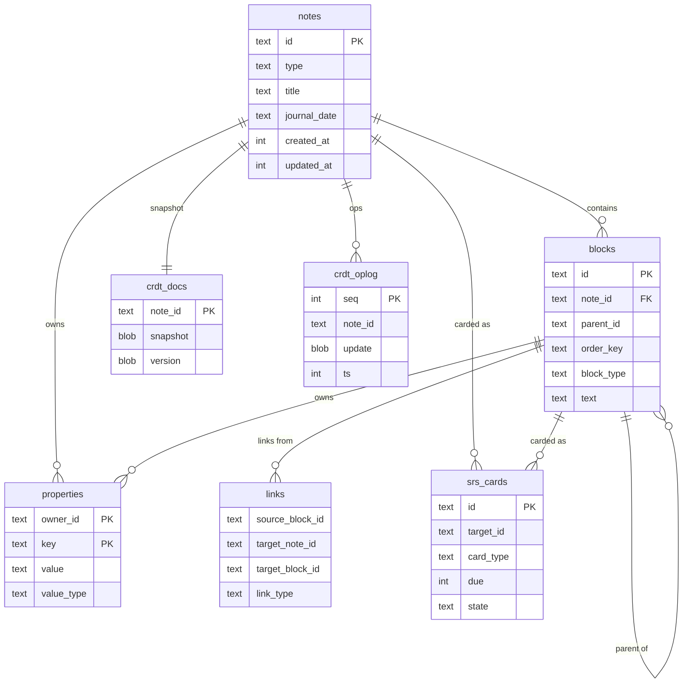

The data model has two halves: the **Loro CRDT** (the source of truth) and the
**SQLite derived indexes** rebuilt from it. The golden rule —
[the CRDT is the only source of truth](/how-it-works/crdt-source-of-truth/) — governs
both ([ADR-001](/architecture/adr/adr-001-block-model-crdt-source-of-truth/)).

## Loro structures

Each note is a Loro document built from three structures
([ADR-002](/architecture/adr/adr-002-crdt-loro/)):

- **`Tree`** — the block hierarchy of a document (move/indent/reorder are clean ops).
- **`Text`** (per block) — the block's text.
- **`Map`** (per block/note) — typed properties, the note type, and SRS state.

## Entity relationships

`crdt_docs` / `crdt_oplog` hold the source of truth; everything else is derived from
them.



## SQLite schema (derived indexes)

Every table below **except `crdt_docs` / `crdt_oplog` is a rebuildable derived
index**. SRS *state* lives in the CRDT as properties; `srs_cards` is just a query
index.

```sql
CREATE TABLE notes (
  id            TEXT PRIMARY KEY,         -- stable (CRDT-generated)
  type          TEXT NOT NULL,            -- 'journal' | 'atomic' | ...
  title         TEXT,
  journal_date  TEXT,                     -- ISO date when type='journal'
  created_at    INTEGER NOT NULL,
  updated_at    INTEGER NOT NULL
);

CREATE TABLE blocks (
  id            TEXT PRIMARY KEY,
  note_id       TEXT NOT NULL REFERENCES notes(id),
  parent_id     TEXT,                     -- NULL = root block
  order_key     TEXT NOT NULL,            -- fractional index for ordering
  block_type    TEXT NOT NULL,            -- 'paragraph' | 'heading' | 'todo' | ...
  text          TEXT NOT NULL DEFAULT ''
);

CREATE TABLE properties (                 -- typed properties (note/block)
  owner_id TEXT NOT NULL, key TEXT NOT NULL,
  value TEXT, value_type TEXT NOT NULL,
  PRIMARY KEY (owner_id, key)
);

CREATE TABLE links (                      -- graph for backlinks
  source_block_id TEXT NOT NULL,
  target_note_id  TEXT, target_block_id TEXT,
  link_type       TEXT NOT NULL           -- 'wikilink' | 'embed' | ...
);

CREATE VIRTUAL TABLE blocks_fts USING fts5(text, content='blocks', content_rowid='rowid');

CREATE VIRTUAL TABLE block_vec USING vec0(block_id TEXT, embedding FLOAT[384]);

CREATE TABLE srs_cards (
  id          TEXT PRIMARY KEY,
  target_id   TEXT NOT NULL,              -- note or block
  card_type   TEXT NOT NULL,              -- 'note' | 'cloze'
  due         INTEGER NOT NULL,
  stability   REAL, difficulty REAL,
  reps        INTEGER, lapses INTEGER,
  state       TEXT,                       -- new|learning|review|relearning
  last_review INTEGER
);

-- The source of truth — never rebuilt from anything else:
CREATE TABLE crdt_docs   (note_id TEXT PRIMARY KEY, snapshot BLOB NOT NULL, version BLOB NOT NULL);
CREATE TABLE crdt_oplog  (seq INTEGER PRIMARY KEY, note_id TEXT NOT NULL, update BLOB NOT NULL, ts INTEGER NOT NULL);
```

## Export `.md` format

One file per note (an atomic note = a file; a journal = one file per day). Structure
and content are round-trip-able; fine-grained history stays in the CRDT (an export is
a snapshot). SRS state is optional in frontmatter and never pollutes the body.

```markdown
---
id: 01J9X4...                 # stable note ID
type: atomic
title: Example atomic note
created: 2026-06-06T10:00:00Z
props:
  status: seedling
srs:                          # optional; can be omitted
  due: 2026-06-10
  stability: 4.2
---

Content in **markdown**, with [[Links To Other Notes]]
and a reference to a specific block. ^01J9X5
```
