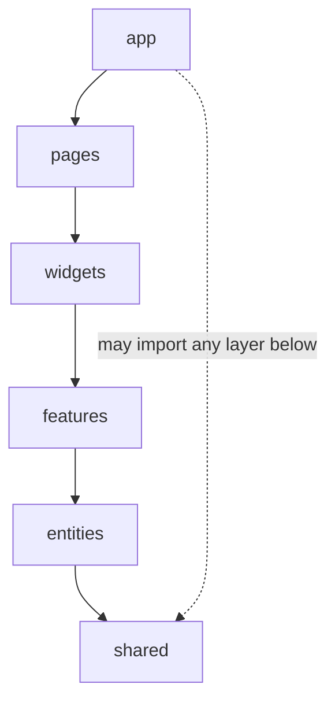

The frontend follows **Feature-Sliced Design (FSD)** exactly, per
[ADR-012](/architecture/adr/adr-012-frontend-fsd/). This page is the canonical
reference for its structure and patterns; the [Design system](/design/principles/)
covers the visual layer.

## Layers & boundaries

Imports flow **down only**, and only through a slice's public API (`index.ts`):



- `app → {pages, widgets, features, entities, shared}`
- `pages → {widgets, features, entities, shared}`
- `widgets → {widgets, features, entities, shared}`
- `features → {entities, shared}`
- `entities → {shared}`
- `shared → {shared}`

Cross-slice imports go **only** through `index.ts`. Deep imports are blocked by
`eslint-plugin-boundaries`.

> **Same-layer imports are allowed by design.** A widget may import another
> widget's public API (e.g. `topbar` opens the `command-palette`). The boundary
> rule is enforced per *layer*, not per *slice*, so it does not forbid
> sibling-slice imports within a layer — a deliberate trade-off for this app's size.

```typescript
// ❌ deep import into a slice's internals
import { something } from '@features/editor/model/store';
// ✅ import only from the public API
import { useEditor } from '@features/editor';
```

## Folder structure

```
src/
├── app/         # init, routes, providers, styles/theme.css
├── pages/       # full-screen routes (home, journal, note/:id, settings…)
├── widgets/     # composed UI (app-shell, topbar, sidebar, command-palette)
├── features/    # user-facing capabilities (editor, search, srs-review, journal)
├── entities/    # domain entities (note, block, link, command)
└── shared/      # ui (Kobalte), lib (theme, i18n), config, api, types
```

Each slice has `ui/`, optional `model/` and `api/`, and a single `index.ts` public
API — the only external import point.

> **Where providers live.** A cross-cutting **context + hook** consumed across
> layers (theming, i18n) lives in `shared/lib` and is re-exported through
> `@shared`; an **app-only** provider (error boundary, sync status, toasts) lives
> in `app/providers`. `app/App.tsx` composes them.
>
> **Where i18n lives.** Config *data* (locales + dictionaries) sits in
> `shared/config/i18n`; the runtime *provider/hook* in `shared/lib/i18n.tsx` —
> data and runtime are split on purpose.

## Stack

- **SolidJS** + **Vite**, TypeScript strict (`noUncheckedIndexedAccess`,
  `exactOptionalPropertyTypes`, …).
- **UnoCSS** — semantic tokens as CSS variables (see
  [Design tokens & themes](/design/tokens-and-themes/)).
- **Kobalte** (headless components) and `lucide-solid` (icons).

## Providers (order matters)

`app/App.tsx` composes the providers (annotated with their home layer):

```
RootErrorBoundary           (app/providers)
  └─ SyncProvider           (app/providers)  ← CRDT/sync status (was RealtimeProvider)
       └─ I18nProvider      (shared/lib)
            └─ ThemeProvider (shared/lib)
                 └─ ToastProvider (app/providers)
                      └─ AppRoutes
```

## Key systems

- **Theming** — `data-theme` + `data-density` on `<html>`; instant swap, no rebuild.
- **i18n** — config data (locales + dictionaries) in `shared/config/i18n`, the
  runtime provider in `shared/lib/i18n.tsx`; lazy dictionaries (en-US bundled,
  pt-BR on demand), `Intl` formatters, `<html lang>` kept in sync.
- **Command palette (⌘K)** — a `command` entity + `useDefaultCommands()` +
  `useCommandPaletteShortcut()` (`@solid-primitives/keyboard`).
- **State** — Solid signals + `createResource` (client/UI) and `makePersisted`
  (local preferences). No server-state cache: data comes from the Rust core via
  Tauri commands, not HTTP.
- **Local-first IPC** — the frontend talks to the Rust core via **Tauri commands**,
  never HTTP ([ADR-005](/architecture/adr/adr-005-rust-js-boundary/)). See the
  [Tauri command API](/architecture/tauri-command-api/).

## Adaptations for Noderium

No auth/session/billing layer (local-first): `AppShell` renders children directly. The
blueprint's `RealtimeProvider` becomes the **`SyncProvider`**. Domain entities and the
`editor` feature enter **after** the shell, gated on Spike #1.
