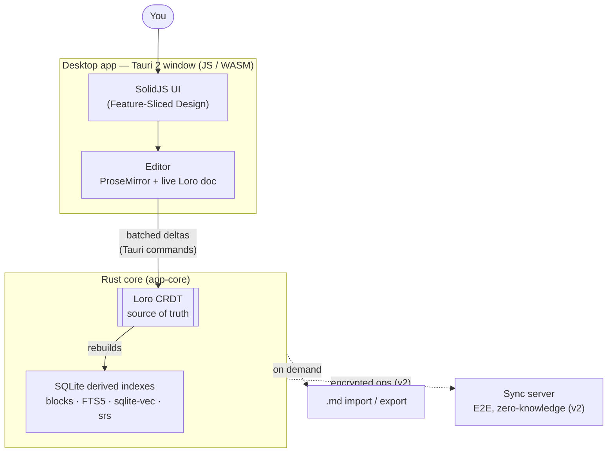

Noderium is a **local-first PKM** that unifies three methods into one workflow:
**journal** (low-friction capture) → **Zettelkasten** (atomic, densely linked notes)
→ **spaced repetition** (retention). The *capture → distill → retain* axis **is** the
product.

## The shape of the system

There are two runtimes joined by a thin, batched boundary:

- **The frontend (JS/WASM)** — a SolidJS SPA in a Tauri 2 window. The **live Loro
  document** is attached to a ProseMirror editor here, so typing never crosses a
  process boundary ([ADR-004](/architecture/adr/adr-004-desktop-tauri-solidjs-editor/)).
- **The Rust core** — owns persistence (SQLite), indexing (FTS5 + sqlite-vec),
  embeddings, the markdown parser, SRS scheduling, crypto, and sync. The same native
  Loro runs here, on the server, and (later) on mobile
  ([ADR-005](/architecture/adr/adr-005-rust-js-boundary/)).

The editor flushes **deltas** to the core in batches — never a round-trip per
keystroke. The core persists the CRDT (the source of truth) and rebuilds its derived
SQLite indexes from it.

## Why this shape

- **Performance** — the [typing budget is < 16 ms](/how-it-works/the-editor/);
  keeping the live doc in WASM next to the editor is what makes that achievable.
- **One model, no duplication** — Loro is the single data model across JS, Rust,
  server, and mobile.
- **Anti-lock-in** — the disk format (Loro) is open and `.md` export is always
  available.

## Where to go next

- [CRDT as source of truth](/how-it-works/crdt-source-of-truth/) — the golden rule and
  rebuildable indexes.
- [The editor](/how-it-works/the-editor/) — ProseMirror + Loro and the latency budget.
- [Search](/how-it-works/search/), [Spaced repetition](/how-it-works/spaced-repetition/),
  and [Sync](/how-it-works/sync/).
- [Architecture overview](/architecture/overview/) — the repo layout and crates.
